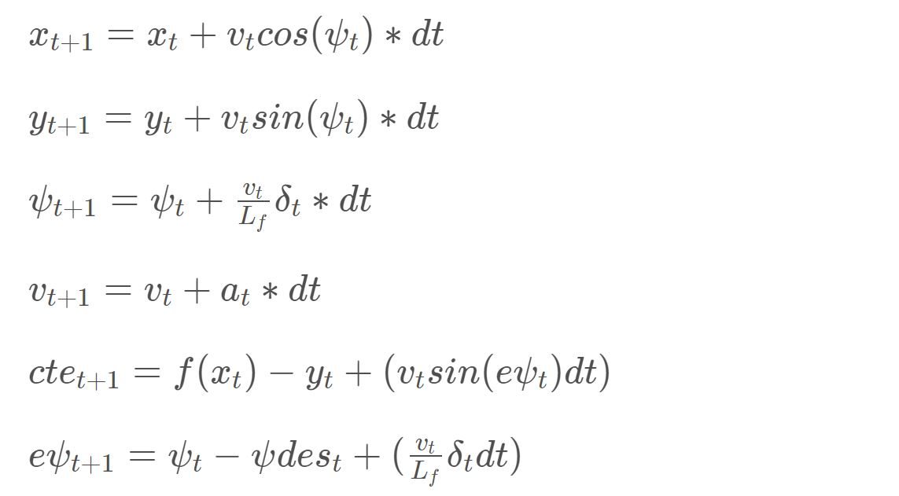

# Model Predictive Control (MPC)
This an implementation of Model Predictive Control using Udacity's Term 2 SDC simulator.

## Compilation

---

### Dependencies

* cmake >= 3.5
 * All OSes: [click here for installation instructions](https://cmake.org/install/)
* make >= 4.1(mac, linux), 3.81(Windows)
  * Linux: make is installed by default on most Linux distros
  * Mac: [install Xcode command line tools to get make](https://developer.apple.com/xcode/features/)
  * Windows: [Click here for installation instructions](http://gnuwin32.sourceforge.net/packages/make.htm)
* gcc/g++ >= 5.4
  * Linux: gcc / g++ is installed by default on most Linux distros
  * Mac: same deal as make - [install Xcode command line tools]((https://developer.apple.com/xcode/features/)
  * Windows: recommend using [MinGW](http://www.mingw.org/)
* [uWebSockets](https://github.com/uWebSockets/uWebSockets)
  * Run either `install-mac.sh` or `install-ubuntu.sh`.
  * If you install from source, checkout to commit `e94b6e1`, i.e.
    ```
    git clone https://github.com/uWebSockets/uWebSockets
    cd uWebSockets
    git checkout e94b6e1
    ```
    Some function signatures have changed in v0.14.x. See [this PR](https://github.com/udacity/CarND-MPC-Project/pull/3) for more details.

* **Ipopt and CppAD:** Please refer to [this document](https://github.com/udacity/CarND-MPC-Project/blob/master/install_Ipopt_CppAD.md) for installation instructions.
* [Eigen](http://eigen.tuxfamily.org/index.php?title=Main_Page). This is already part of the repo so you shouldn't have to worry about it.
* Simulator. You can download these from the [releases tab](https://github.com/udacity/self-driving-car-sim/releases).
* Not a dependency but read the [DATA.md](./DATA.md) for a description of the data sent back from the simulator.


### Basic Build Instructions

1. Clone this repo.
2. Make a build directory: `mkdir build && cd build`
3. Compile: `cmake .. && make`
4. Run it: `./mpc`.

## Implementation

### Tips

1. It's recommended to test the MPC on basic examples to see if your implementation behaves as desired. One possible example
is the vehicle starting offset of a straight line (reference). If the MPC implementation is correct, after some number of timesteps
(not too many) it should find and track the reference line.
2. The `lake_track_waypoints.csv` file has the waypoints of the lake track. You could use this to fit polynomials and points and see of how well your model tracks curve. NOTE: This file might be not completely in sync with the simulator so your solution should NOT depend on it.
3. For visualization this C++ [matplotlib wrapper](https://github.com/lava/matplotlib-cpp) could be helpful.)
4.  Tips for setting up your environment are available [here](https://classroom.udacity.com/nanodegrees/nd013/parts/40f38239-66b6-46ec-ae68-03afd8a601c8/modules/0949fca6-b379-42af-a919-ee50aa304e6a/lessons/f758c44c-5e40-4e01-93b5-1a82aa4e044f/concepts/23d376c7-0195-4276-bdf0-e02f1f3c665d)
5. **VM Latency:** Some students have reported differences in behavior using VM's ostensibly a result of latency.  Please let us know if issues arise as a result of a VM environment.

### The Model

The model consists of a 6 element state vector, a 2 element actuator vector, and update functions to calculate value
changes over time ( eg. `k_t-1` to `k_t`). 

The state vector, `[x,y,ψ,v,cte,eψ]` tracks the vehicle's x and y position,
orientation (`psi`, or `ψ`), velocity cross-track error (`cte`, the error between the center of the road and the vehicle's
position), and the orientation error (`eψ`).

The actuator vector, `[δ,a]` tracks the changes applied to orientation (`δ`) and acceleration for the next state.

The vehicle model update functions are as follows:



Where `dt` is the elapsed time between states, `Lf` is a vehicle-specific constant to help model the vehicle's steering
characteristics, and `ψdes` is the desired `ψ` value.

### Timestep Length and Elapsed Duration (N & dt)

For my implementation, I chose a value of 10 for the timestep length (N) and 0.05 for the Elapsed Duration (dt).  I tried
several other values, but ultimately, the one's I settled on seemed the most stable in the experiments I ran in the simulator.

### Polynomial Fitting and MPC Preprocessing

The waypoints received from the simulator, and representing the trajectory, are transformed from global coordinates to 
the vehicle's local coordinate space.  This transformation means the vehicle's x/y location and orientation are all 0, 
and all other points are characterized as offsets from it.  These localized waypoint locations are then fitted to a 3rd
order polynomial.

### Model Predictive Control with Latency

In a real car, an actuation command won't execute instantly - there will be a delay as the command propagates through 
the system.  In an attempt to approximate a bit of realism, this model assumes 100ms of actuation latency.

To achieve this, we use the model/state update functions above to predict the state after 100ms.  Therefore, we must
replace `dt` with the `latency` value of `0.1`, and calculate the predicted state update before sending the actuation
command.

## Simulation

### The vehicle must successfully drive a lap around the track.

The controller can handle a consistent reference velocity of 100mph, and drive around the track safely, and continuously.